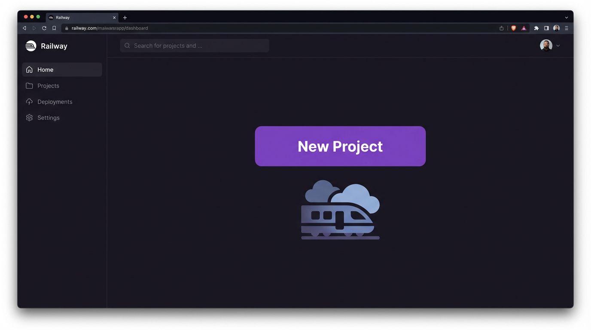
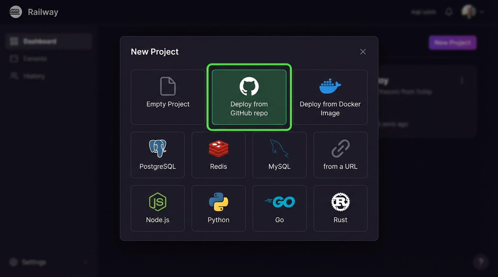
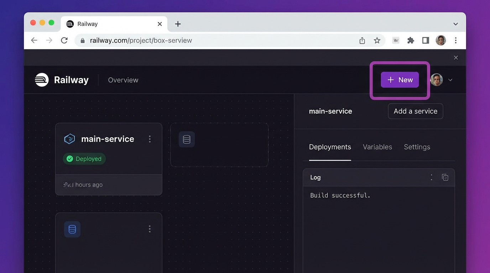
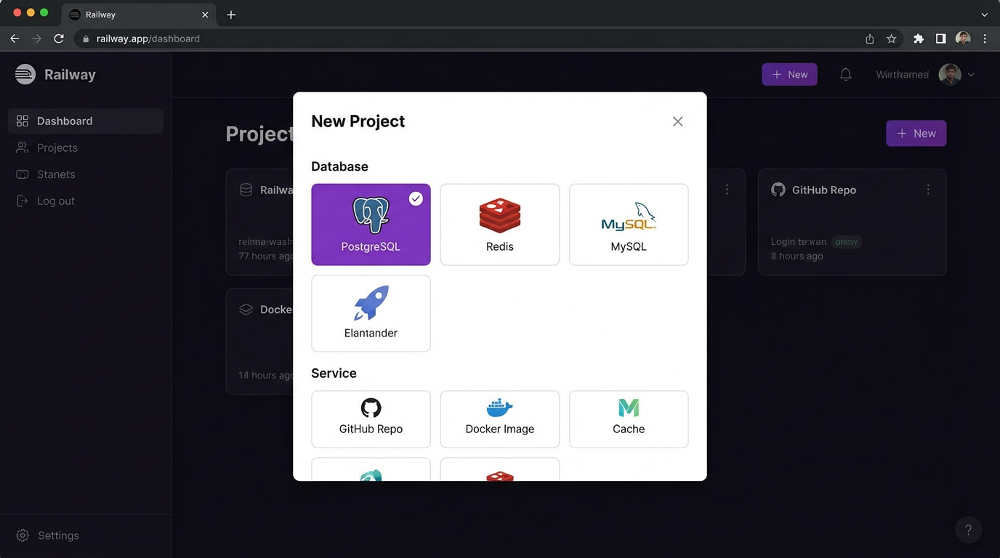
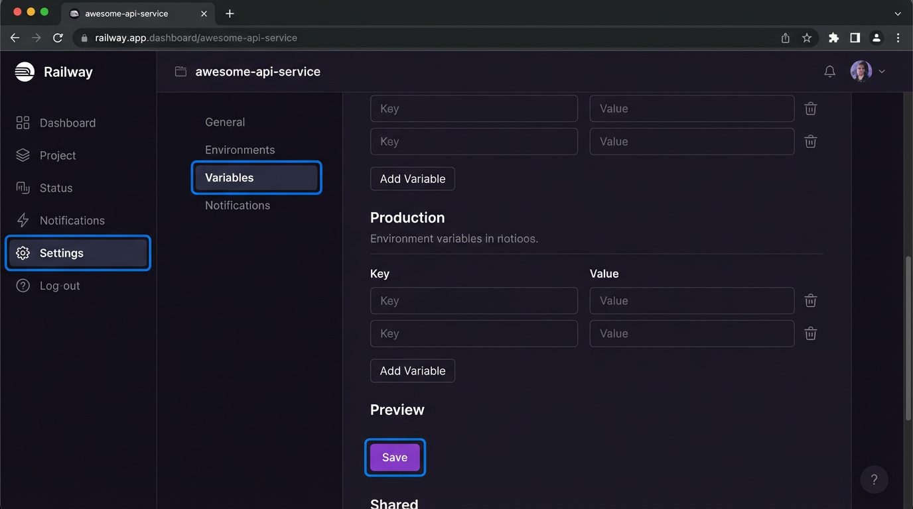
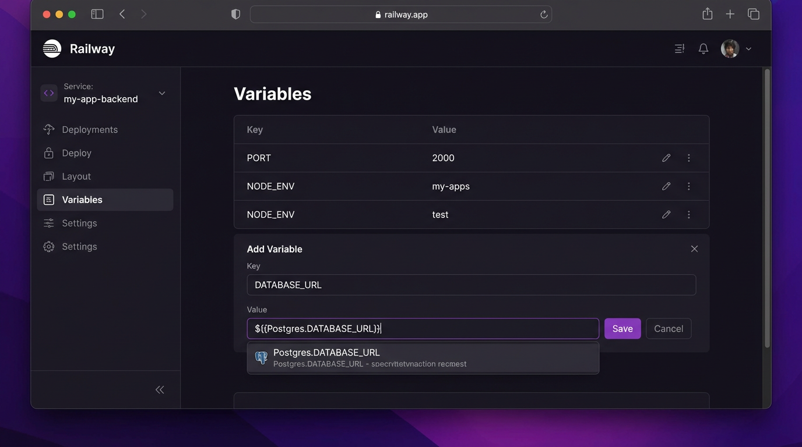

# دليل النشر المصور لمشروع `nabdh-ai-tools` على Railway

أهلاً بك! بما أن المتصفح لم يعمل كما هو متوقع، قمت بإعداد هذا الدليل المصور المفصل ليقودك خطوة بخطوة خلال عملية نشر مشروعك على منصة Railway. لقد تم تجهيز مستودعك بالفعل بكل الملفات المطلوبة.

--- 

### الخطوة 1: إنشاء مشروع جديد

ابدأ من لوحة تحكم Railway الرئيسية. انقر على زر **"New Project"** للبدء.

---

### الخطوة 2: النشر من مستودع GitHub

ستظهر لك نافذة بها عدة خيارات. اختر **"Deploy from GitHub repo"** لربط حسابك على GitHub.

---

### الخطوة 3: اختيار المستودع الصحيح

من قائمة مستودعاتك، اختر **`amiraq1/nabdh-ai-tools`**. ستبدأ Railway تلقائياً في عملية البناء والنشر الأولية.

---

### الخطوة 4: إضافة قاعدة بيانات

بعد اكتمال النشر الأول، ستحتاج إلى إضافة قاعدة بيانات. في لوحة تحكم المشروع، انقر على زر **"New"** أو **"Add a service"**.

---

### الخطوة 5: اختيار قاعدة بيانات PostgreSQL

من الخيارات المتاحة، اختر **"Database"** ثم **"PostgreSQL"**. سيقوم Railway بإنشاء خدمة قاعدة بيانات جديدة وربطها بمشروعك.

---

### الخطوة 6: الانتقال إلى المتغيرات البيئية

الآن، افتح الخدمة الخاصة بتطبيقك (التي تحمل اسم `nabdh-ai-tools`) وانتقل إلى تبويب **"Variables"** لإضافة مفاتيح API والأسرار المطلوبة.

---

### الخطوة 7: إضافة المتغيرات وربط قاعدة البيانات

هذه هي أهم خطوة. أضف المتغيرات التالية:

1.  **`DATABASE_URL`**: لربط قاعدة البيانات، ابدأ بكتابة `${` وستقترح Railway تلقائياً متغير `Postgres.DATABASE_URL`. اختره.
2.  **`SESSION_SECRET`**: أضف مفتاحاً سرياً عشوائياً وقوياً هنا (مثال: `openssl rand -hex 32`).
3.  **`NODE_ENV`**: اضبط القيمة على `production`.

إذا كان مشروعك يحتاج متغيرات أخرى (مثل مفاتيح Google API)، أضفها هنا أيضاً.

---

### الخطوة الأخيرة: اكتمال النشر

بمجرد حفظ المتغيرات، ستقوم Railway تلقائياً بإعادة نشر تطبيقك. بعد اكتمال هذه العملية، سيكون موقعك جاهزاً للعمل ومتصلاً بقاعدة البيانات.

أتمنى أن يكون هذا الدليل واضحاً ومفيداً. إذا واجهت أي مشاكل، فلا تتردد في السؤال!
